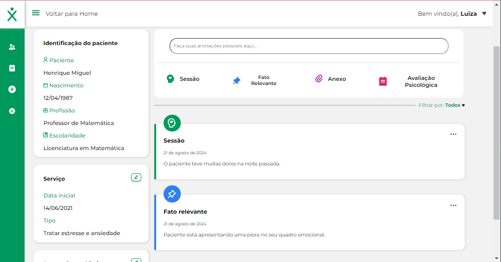

# Wexer Psi 📏💡📋

## Interface for Psychologists' Patient Management

**Wexer Psi** is a platform that provides psychologists with the best possible organization for managing their patients. It allows for the registration of patients and the maintenance of a comprehensive history of appointments, categorized into four main types: sessions, relevant facts, attachments, and psychological assessments.



**Project Name:** Wexer Psi 📏💡📋  
**Development Start Date:** 20/03/2023 ⏩  
**Development Completion Date:** 03/05/2023 🏁  
**Status:** Completed ✅

🚀 **Deployment Link:** [Vercel Deploy](https://project-wexer.vercel.app/)
🎨 **Figma Project Link:** [Wexer Figma](<https://www.figma.com/design/t5Z08FWfTexsU1Lj4WvmrL/Wexer-Psi-%7C-Prontu%C3%A1rio-V4-(Copy)?node-id=0-1&t=qswzIWb4pIHjUfuJ-0>)

## **Technologies Used:** 🛠️

- **React.js** with Vite for quick project setup
- **TypeScript** for static typing
- **React-menu-hamburger** for creating interactive menus
- **React-Router-Dom** for route management
- **Axios** for HTTP requests
- **React-Toastify** for success and error notifications
- **React Quill** for text editing
- **Material UI** for styling

## Project Description 📝

Wexer Psi is a management tool for psychologists, allowing them to register patients and maintain a detailed history of all appointments. The information is organized into four main categories: sessions, relevant facts, attachments, and psychological assessments, providing a comprehensive and organized view of each case.

## Key Features 🔧

- **Psychologist Registration:** Allows psychologists to register with information such as name, email, phone number, and address.
- **Login:** Secure authentication via email and password.
- **Patient Registration:** Complete registration of patients, including name, email, phone number, and address.
- **Appointment History:** Chronological view of all appointments made for each patient.
- **Session Creation:** Scheduling and recording of sessions with details such as date, time, and location.
- **Relevant Facts Creation:** Recording of significant events for each patient.
- **Attachments Creation:** Upload and organization of documents and files related to patients.
- **Psychological Assessments Creation:** Recording and monitoring of assessments performed for each patient.
- **Appointment Editing:** Updating information for sessions and other appointments.
- **Payment Management:** Control and monitoring of payments made by patients.

## How to Run the Project 🚀

1. Clone the repository:
   ```bash
   git clone https://github.com/LadyJessie19/frutamix-frontend.git
   ```
2. Navigate to the project directory:
   ```bash
   cd wexer-psi
   ```
3. Install dependencies:
   ```bash
   npm install
   ```
4. Run the project:
   ```bash
   npm run dev
   ```

## Development Team 🙋‍♀️


- Developer: [Jessie Bentes](https://github.com/LadyJessie19)

## How to Contribute 🆘

If you want to contribute to the project, follow these steps:

1. Fork the project.
2. Create a new branch (`git checkout -b feature/new-feature`).
3. Commit your changes (`git commit -am 'Add new feature'`).
4. Push to the branch (`git push origin feature/new-feature`).
5. Create a new Pull Request.

## License 🧐

This project is licensed under the [MIT License](https://opensource.org/licenses/MIT).
