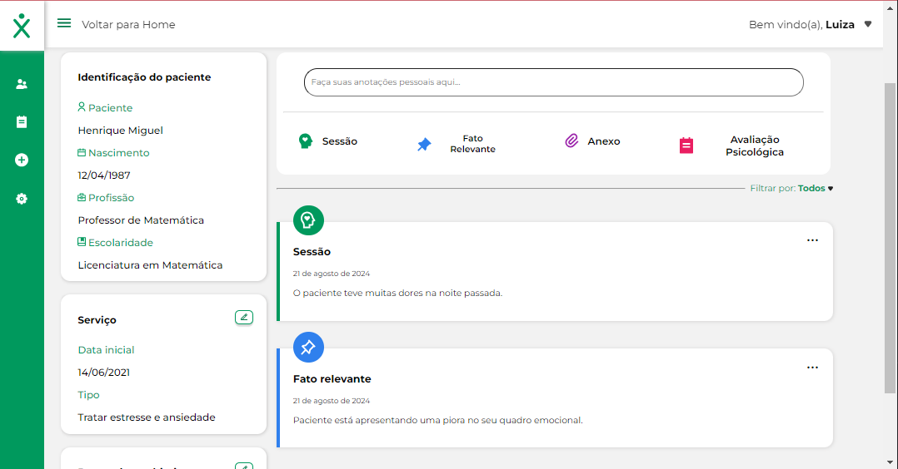

# Wexer Psi 📏💡📋

###### _Pssst! English version of this README is available [here](./EN_US.md)._

## Interface para Gerenciamento de Pacientes de Psicólogos

**Wexer Psi** é uma plataforma que oferece aos psicólogos a melhor organização possível com seus pacientes. Através dela, é possível cadastrar pacientes e manter um histórico completo de atendimentos, dividido em quatro tipos principais: sessões, fatos relevantes, anexos e avaliações psicológicas.



**Nome do Projeto:** Wexer Psi 📏💡📋  
**Data de Início do Desenvolvimento:** 20/03/2023 ⏩  
**Data de Conclusão do Desenvolvimento:** 03/05/2023 🏁  
**Status:** Concluído ✅

🚀 **Link de Deploy:** [Vercel Deploy](https://project-wexer.vercel.app/)
🎨 **Link para o Figma do projeto:** [Wexer Figma](<https://www.figma.com/design/t5Z08FWfTexsU1Lj4WvmrL/Wexer-Psi-%7C-Prontu%C3%A1rio-V4-(Copy)?node-id=0-1&t=qswzIWb4pIHjUfuJ-0>)

## **Tecnologias Utilizadas:** 🛠️

- **React.js** com Vite para inicialização rápida do projeto
- **TypeScript** para tipagem estática
- **React-menu-hamburger** para criação de menus interativos
- **React-Router-Dom** para gerenciamento de rotas
- **Axios** para requisições HTTP
- **React-Toastify** para notificações de sucesso e erro
- **React Quill** para edição de texto
- **Material UI** para estilização

## Descrição do Projeto 📝

Wexer Psi é uma ferramenta de gestão para psicólogos, que permite o cadastro de pacientes e mantém um histórico detalhado de todos os atendimentos realizados. As informações são organizadas em quatro categorias principais: sessões, fatos relevantes, anexos e avaliações psicológicas, proporcionando uma visão abrangente e organizada de cada caso.

## Principais Funcionalidades 🔧

- **Cadastro de psicólogos:** Permite a inserção de informações como nome, email, telefone e endereço.
- **Login:** Autenticação segura através de email e senha.
- **Cadastro de pacientes:** Registro completo de pacientes, incluindo nome, email, telefone e endereço.
- **Histórico de atendimentos:** Visualização cronológica dos atendimentos realizados para cada paciente.
- **Criação de sessões:** Agendamento e registro de sessões com detalhes como data, hora e local.
- **Criação de fatos relevantes:** Registro de eventos significativos para cada paciente.
- **Criação de anexos:** Upload e organização de documentos e arquivos relacionados aos pacientes.
- **Criação de avaliações psicológicas:** Registro e acompanhamento das avaliações feitas para cada paciente.
- **Edição de atendimentos:** Atualização das informações de sessões e outros atendimentos.
- **Gerenciamento de pagamento:** Controle e monitoramento dos pagamentos realizados pelos pacientes.

## Como Rodar o Projeto 🚀

1. Clone o repositório:
   ```bash
   git clone https://github.com/LadyJessie19/frutamix-frontend.git
   ```
2. Navegue até o diretório do projeto:
   ```bash
   cd wexer-psi
   ```
3. Instale as dependências:
   ```bash
   npm install
   ```
4. Execute o projeto:
   ```bash
   npm run dev
   ```

## Equipe de Desenvolvimento 🙋‍♀️


- Desenvolvedora: [Jessie Bentes](https://github.com/LadyJessie19)

## Como Contribuir 🆘

Se você deseja contribuir para o projeto, siga estes passos:

1. Faça um fork do projeto.
2. Crie uma nova branch (`git checkout -b feature/new-feature`).
3. Commit suas alterações (`git commit -am 'Add new feature'`).
4. Faça o push para a branch (`git push origin feature/new-feature`).
5. Crie um novo Pull Request.

## Licença 🧐

Este projeto está licenciado sob a [Licença MIT](https://opensource.org/licenses/MIT).
